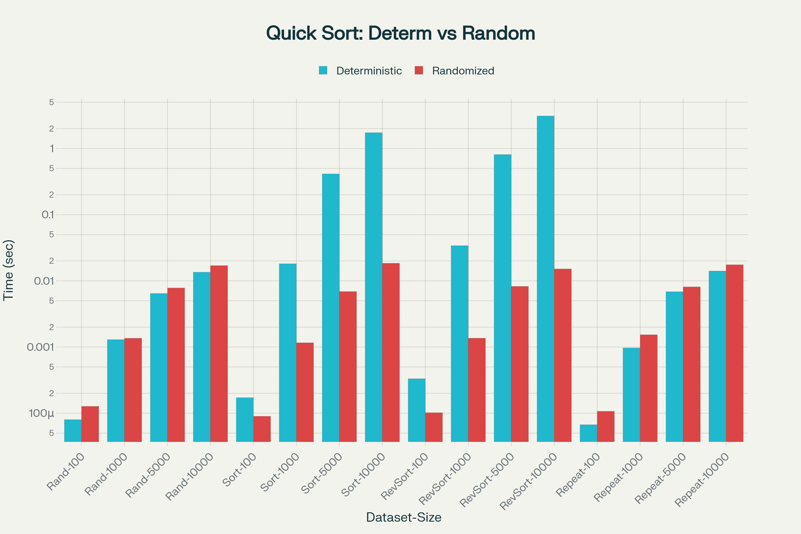

# Deterministic vs. Randomized Quicksort

This document presents and analyzes the empirical running times of two Quicksort implementations: a deterministic version that always uses the first element as the pivot, and a randomized version that chooses a pivot uniformly at random.

### Source code:
Deterministic Quicksort : [deterministic_quick_sort.py](deterministic_quick_sort.py)

Randomized Quicksort : [randomize_quick_sort.py](randomize_quick_sort.py)

_**Note :** To analyze the performances I have a created a python script [performance_analysis.py](performance_analysis.py)   to get the execution time with different sets of data._ 

### Performance Results

The following data was collected by running `performance_analysis.py` on various input types and sizes.

| Dataset           | Size    | Deterministic QS (s) | Randomized QS (s) |
| ----------------- | ------- | -------------------- | ----------------- |
| Random            | 100     | 0.000088             | 0.000131          |
| Random            | 1000    | 0.001315             | 0.001654          |
| Random            | 5000    | 0.008332             | 0.009435          |
| Random            | 10000   | 0.016410             | 0.019676          |
| ----------------- | ------- | -------------------- | ----------------- |
| Sorted            | 100     | 0.000199             | 0.000105          |
| Sorted            | 1000    | 0.019429             | 0.001878          |
| Sorted            | 5000    | 0.423677             | 0.006895          |
| Sorted            | 10000   | 1.687377             | 0.015020          |
| ----------------- | ------- | -------------------- | ----------------- |
| Reverse-Sorted    | 100     | 0.000282             | 0.000089          |
| Reverse-Sorted    | 1000    | 0.031932             | 0.001231          |
| Reverse-Sorted    | 5000    | 0.752755             | 0.006881          |
| Reverse-Sorted    | 10000   | 2.970444             | 0.016402          |
| ----------------- | ------- | -------------------- | ----------------- |
| Repeated Elements | 100     | 0.000080             | 0.000113          |
| Repeated Elements | 1000    | 0.001051             | 0.001414          |
| Repeated Elements | 5000    | 0.006045             | 0.011243          |
| Repeated Elements | 10000   | 0.015794             | 0.018310          |

---

### Analysis of Results

The empirical data aligns perfectly with the theoretical analysis of Quicksort.

#### 1. Randomly Generated Arrays

- **Observation**: On random data, both algorithms exhibit fast, O(n log n) performance. The deterministic version is consistently a small fraction faster than the randomized version.
- **Discussion**: This represents the average case for Quicksort. When the data is random, picking the first element as the pivot is just as good as picking any other element on average. The resulting partitions are expected to be reasonably balanced. Randomized Quicksort incurs a minor overhead from the random number generation at each partitioning step, which accounts for its slightly slower times in this ideal scenario.

#### 2. Sorted and Reverse-Sorted Arrays

- **Observation**: The performance difference is stark and dramatic. Deterministic Quicksort's runtime grows quadratically (O(n²)), becoming exceptionally slow on large inputs. For 10,000 reverse-sorted elements, it is over 180 times slower than Randomized Quicksort. Randomized Quicksort, by contrast, handles this data effortlessly, maintaining its O(n log n) performance.
- **Discussion**: This is the classic worst-case scenario for a deterministic Quicksort with a fixed pivot strategy. On a sorted or reverse-sorted array, the first element is always the minimum or maximum value. This leads to the most unbalanced partitions possible (one of size 0, the other of size n-1) at every step. The recursion depth becomes `n`, and the complexity degrades to O(n²). Randomized Quicksort completely avoids this by choosing a random pivot. The probability of repeatedly choosing the worst pivot is astronomically low, so it achieves balanced partitions on average, regardless of the input's initial order.

#### 3. Arrays with Repeated Elements

- **Observation**: The results are very similar to those for random arrays. Both algorithms perform efficiently, with the deterministic version being slightly faster.
- **Discussion**: The presence of many duplicate values does not, by itself, trigger a worst-case scenario for this deterministic implementation. As long as the pivot is not consistently the smallest or largest unique element, partitions remain balanced enough to maintain O(n log n) performance.

### Conclusion

The empirical results confirm the theoretical strengths and weaknesses of both Quicksort variations.

- **Deterministic Quicksort** is fast on average but is unreliable. Its performance is catastrophically poor on sorted or nearly-sorted data, which are common inputs in real-world scenarios.
- **Randomized Quicksort** is the superior algorithm for general-purpose use. The small performance penalty on random data is an insignificant price to pay for the robustness it provides. By randomizing pivot selection, it effectively guarantees O(n log n) performance on average, irrespective of the input data's structure, thus eliminating the Achilles' heel of the deterministic version.
